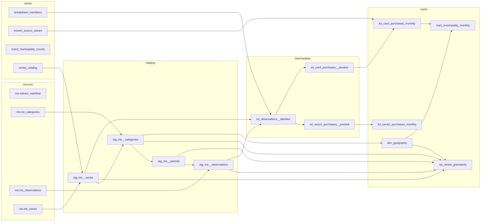

# dbt lineage

Generated by `ptdata docs` from `manifest.json`; do not edit by hand.

```mermaid
flowchart LR
  subgraph sources
    ine_extract_manifest[ine.extract_manifest]
    ine_ine_categories[ine.ine_categories]
    ine_ine_observations[ine.ine_observations]
    ine_ine_series[ine.ine_series]
  end
  subgraph seeds
    breakdown_members[breakdown_members]
    known_source_issues[known_source_issues]
    nuts3_municipality_counts[nuts3_municipality_counts]
    series_catalog[series_catalog]
  end
  subgraph staging
    stg_ine__categories[stg_ine__categories]
    stg_ine__observations[stg_ine__observations]
    stg_ine__periods[stg_ine__periods]
    stg_ine__series[stg_ine__series]
  end
  subgraph intermediate
    int_card_purchases__pivoted[int_card_purchases__pivoted]
    int_observations__labelled[int_observations__labelled]
    int_sector_purchases__pivoted[int_sector_purchases__pivoted]
  end
  subgraph marts
    dim_geography[dim_geography]
    fct_card_purchases_monthly[fct_card_purchases_monthly]
    fct_sector_purchases_monthly[fct_sector_purchases_monthly]
    mart_municipality_monthly[mart_municipality_monthly]
    rpt_series_granularity[rpt_series_granularity]
  end
  breakdown_members --> int_observations__labelled
  dim_geography --> mart_municipality_monthly
  dim_geography --> rpt_series_granularity
  fct_card_purchases_monthly --> mart_municipality_monthly
  ine_ine_categories --> stg_ine__categories
  ine_ine_observations --> stg_ine__observations
  ine_ine_series --> stg_ine__series
  int_card_purchases__pivoted --> fct_card_purchases_monthly
  int_observations__labelled --> int_card_purchases__pivoted
  int_observations__labelled --> int_sector_purchases__pivoted
  int_sector_purchases__pivoted --> fct_sector_purchases_monthly
  known_source_issues --> fct_card_purchases_monthly
  series_catalog --> stg_ine__series
  stg_ine__categories --> dim_geography
  stg_ine__categories --> rpt_series_granularity
  stg_ine__categories --> stg_ine__periods
  stg_ine__observations --> int_observations__labelled
  stg_ine__observations --> rpt_series_granularity
  stg_ine__periods --> rpt_series_granularity
  stg_ine__periods --> stg_ine__observations
  stg_ine__series --> int_observations__labelled
  stg_ine__series --> rpt_series_granularity
  stg_ine__series --> stg_ine__categories
```
